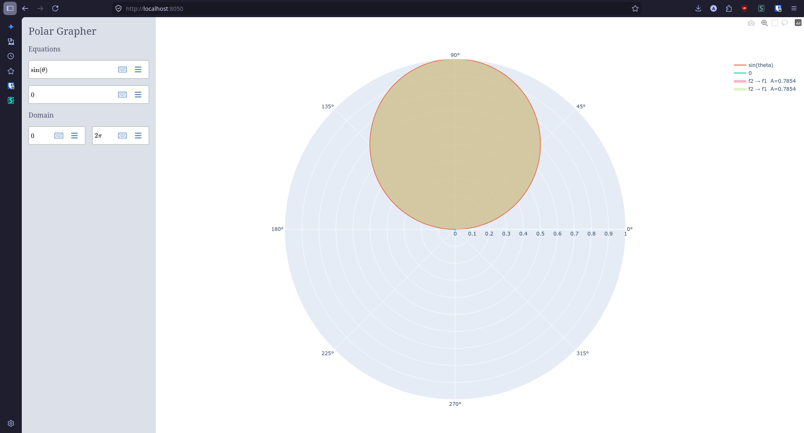
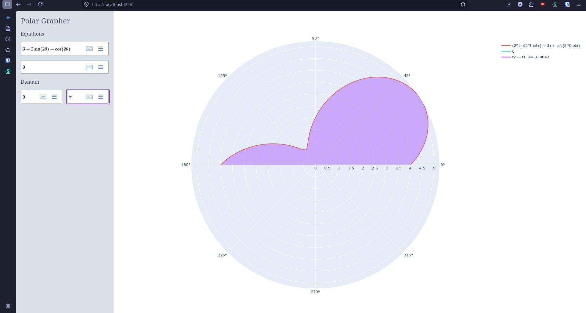

# Polar Improved

Web-based polar grapher to graph polar functions and show the intersection of the graphs, along with the detected area/regions of the graphs.

## Screenshots



The default view of the project when it's first opened.



Function graphed from this year (2026)'s AP Calc BC polar FRQ.

## Tech Stack

- **Frontend**: 
  - Dash - Interactive Python web framework
  - Plotly - Advanced graphing library
  - dash_mathlive - LaTeX equation editor component
  - CSS - Custom styling

- **Backend**:
  - Python - Basically everything is written in python
  - SymPy - Symbolic mathematics
  - NumPy- Numerical computing
  - SciPy - Scientific computing to make it fast
  - Lark - Parser library

## Motivation

Desmos is great when graphing rectangular or parametric functions, but currently, when graphing polar functions, it's pretty bad, as it doesn't show intersection points (unlike with rectangular graphs), and area calculations have to be done manually. To solve that, polar-improved provides functionality that shows auto-detected intersection points, and also auto-detected regions.

## How It Works

### 1. **Equation Input**
There are 2 LaTeX input fields that take in input from the user for both graphs, and there are 2 additional fields for the domain's start and end in radians.

### 2. **Parsing**
- LaTeX input is parsed using SymPy's LaTeX parser

### 3. **Graphing**
- Equations are evaluated across the specified domain
- Both curves are rendered

### 4. **Intersection Detection**
- The system automatically solves for intersection points between the two polar curves
- Intersection points are marked

### 5. **Region Calculations**
- The application identifies enclosed regions created by the intersecting curves and the axes
- For each region, it calculates the enclosed area using integration using the standard formula
- Each region is shaded on the graph with a label displaying its computed area

## Setup & Installation

### Local Development
1. **Install Python**
2. **Create a virtual environment**:
   ```bash
   python3 -m venv .venv
3. **Activate the venv (differs depending on shell)**:
  ```bash
  source .venv/bin/activate
  ```
5. **Install required packages**:
  ```bash
  cd src
  pip install -r requirements.txt
  ```
7. **Run**
  If you want the web view: python src/app.py
  To test intersections and regions using matplotlib: python src/native.py


## AI Usage
AI was used in this project in the following ways:
1. Helping to debug app.py so that it works on Render
2. Helping fix bugs in regions.py and solver.py
